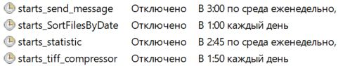

# **BBSAT**

 


---

GDAL :

  

---

+ ## **RU**

## :white_check_mark: Проект для обработки приходящей спутниковой информации

### Задача проекта:

+ [x] Обработка и сортировка приходящих космических снимков земли.
+ [x] Расчет статистической информации о количестве обработанных космических снимков земли и приходящих исходных файлов
  на антенну научно-исследовательского института.
+ [x] Рассылка с краткой сводкой по расчетной и статистической информацией на e-mail :e-mail: адреса.

### Описание:

* #### :ballot_box_with_check: Проект реализован при помощи следующего программного обеспечения, модулей и библиотек:
    * [x] Интерпретатор языка программирования Python здесь версии 3.11.4.
    * [x] Написан код данного проекта в среде разработки PyCharm 2024.1.4 (Community Edition).
    * [x] Реализован проект на операционной системе Windows 10 Pro.

* :large_blue_circle: Пакет GDAL используется в данном проекте как вызываемое из системы приложение (Важно! Чтобы
  вызывать GDAL из системы он должен быть в системной переменной Path). Само приложение вы можете скачать по данной
  ссылке:
  [Ссылка для скачивания GDAL](https://www.gisinternals.com/release.php) - вам понадобится данная версия:
  **release-1930-x64-gdal-3-9-1-mapserver-8-2-0**

* :large_blue_circle: Ниже приведена таблица со всеми импортируемыми пакетами данного проекта [*смотрите таблицу 2*]

### Дополнительно:

* #### :information_source: Софт данного проекта запускается локально, на персональном компьютере, с помощью приложения планировщика задач (taskschd.msc) на ОС Windows, несколькими способами:
    * [x] Первый способ это настроить в планировщике задач ежедневный запуск файла ```run_bbsat.bat``` [*смотрите
      таблицу 1 пример
      1*] (При использовании данного способа рекомендуется в настройке действия указать файл .bat как аргумент, а
      программу запуска ```С:\Windows\System32\cmd.exe```. Также не забывайте про права пользователя при настройке
      работы задачи).
    * [x] Второй способ это указать планировщику задач напрямую запускать файл ```main.py``` [*смотрите таблицу 1 пример
      2*] (Но
      будьте внимательны для реализации этого способа main.py должен подаваться как аргумент, а интерпретатор как
      программа запуска).
    * [x] Третий способ аналогично, как, и во втором способе, но уже настроить запуск не одного, а четырех
      скриптов: ```SortFilesByData.py```, ```tiff_comperssor.py```, ```statistic.py```, ```send_message.py``` через
      планировщик задач.
      Расписание можно настроить вручную в том-же планировщике задач [*смотрите таблицу 1 пример 3*].

* :ballot_box_with_check: В проекте также организован вывод хода работы и информации об ошибке или успехе в специальные
  файлы логирования
  которые называются: ```tack_log.txt```, ```bat_log.txt```. Учтите что если не будете использовать для запуска
  файлы ```main.py``` и ```run_bbsat.bat``` то и логирования не будет.

---

+ ## **EN**

## :white_check_mark: Project for processing incoming satellite information

### Project task:

+ [x] Processing and sorting incoming space images of the Earth.
+ [x] Calculating statistical information on the number of processed space images of the Earth and incoming source files
  to the antenna of the research institute.
+ [x] Sending a brief summary of the calculated and statistical information to e-mail:e-mail: addresses.

### Description:

* #### :ballot_box_with_check: The project is implemented using the following software, modules and libraries:
    * [x] The Python programming language interpreter here is version 3.11.4.
    * [x] The code for this project was written in the PyCharm 2024.1.4 (Community Edition) development environment.
    * [x] The project was implemented on the Windows 10 Pro operating system.

* :large_blue_circle: The GDAL package is used in this project as a system-callable application (Important! In order to
  call GDAL from the system, it must be in the system Path variable). You can download the application itself from this
  link:
  [GDAL download link](https://www.gisinternals.com/release.php) - you will need this version:
  **release-1930-x64-gdal-3-9-1-mapserver-8-2-0**

* :large_blue_circle: Below is a table with all imported packages of this project [*see table 2*]

### Additional:

* #### :information_source: The software of this project is launched locally, on a personal computer, using the task scheduler application (taskschd.msc) on Windows OS, in several ways:
    * [x] The first way is to configure the task scheduler to launch the file ```run_bbsat.bat``` daily [*see table 1
      example
      1*] (
      When using this method, it is recommended to specify the .bat file as an argument in the action setup, and the
      launcher ```С:\Windows\System32\cmd.exe```. Also, do not forget about user rights when setting up the task).
    * [x] The second way is to tell the task scheduler to directly launch the file ```main.py``` [*see table 1 example
      2*] (But
      be
      careful that to implement this method, main.py must be supplied as an argument, and the interpreter as the
      launcher).
    * [x] The third method is similar to the second method, but now configure the launch of not one, but four
      scripts: ```SortFilesByData.py, tiff_comperssor.py, statistic.py, send_message.py``` via the task scheduler. The
      schedule can be configured manually in the same task scheduler [*see table 1 example 3*].

* :ballot_box_with_check: The project also organizes the output of the work progress and information about errors or
  success in special logging
  files called: ```tack_log.txt```, ```bat_log.txt```. Note that if you do not use the ```main.py```
  and ```run_bbsat.bat``` files for launching, there will be no logging.

---

## :clipboard: Таблица 1 Пример планировщик задач : Table 1 Example task scheduler

|    №    |   Изображения примеров : Example images    |
|:-------:|:------------------------------------------:|
| **(1)** |  |
| **(2)** |  |
| **(3)** |  |

> **!** Пример расписания настроенного в ОС Windows 10 Pro в приложении (taskschd.msс)
>
> **!** An example of a schedule configured in Windows 10 Pro OS in the (taskschd.msc) application

## :scroll: Таблица 2 Импортируемые пакеты : Table 2 Imported packages

| Язык : Language | Пакет : Package | Версия : Version |
|:---------------:|:---------------:|:----------------:|
|     Python      |      base       |      0.0.0       |
|     Python      |  configparser   |      7.0.0       |
|     Python      |     future      |      1.0.0       |
|     Python      |      glob2      |       0.7        |
|     Python      |      mime       |      0.1.0       |
|     Python      |       pip       |       24.2       |
|     Python      |     PyMySQL     |      1.1.1       |
|     Python      |    schedule     |      1.2.2       |
|     Python      |   setuptools    |      68.2.0      |
|     Python      |     shutils     |      0.1.0       |
|     Python      |      wheel      |      0.41.2      |

---

| Центр Ледовой и Гидрометеорологической Информации (ЦЛГМИ) Центр "Север" | Center of Ice and Hydrometeorological Information (CIHMI) Center "Sever" |
|:-----------------------------------------------------------------------:|:------------------------------------------------------------------------:|
|     Арктический и антарктический научно-исследовательский институт      |                 Arctic and Antarctic Research Institute                  |
|                      ФГБУ "ААНИИ", Санкт-Петербург                      |                       FSBI "AARI", St. Petersburg                        |
|                          Почта: sever@aari.ru                           |                          E-mail: sever@aari.ru                           |
|                         Почта: vvbusev@aari.ru                          |                         E-mail: vvbusev@aari.ru                          |
|                                           |                                        |

---

<p align="center">
  
</p>
