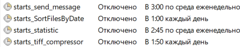

# **BBSAT**

 

---

GDAL :

  

---

+ ## *RU*

## :white_check_mark: Проект для обработки приходящей спутниковой информации

### На данный момент в проекте реализованно несколько скриптов для:

+ [x] Обработки и сортирования приходящих космических снимков земли.
+ [x] Расчета статистической информации о планируемых пролетах и снимках.
+ [x] Рассылки e-mail :e-mail: адресатам краткой сводки с сопутствующей расчетной информации.

### Дополнительно:

* :chart: Софт данного проекта запускается локально, на персональном компьютере, с помощью планировщика задач (
  taskschd.msc) несколькими способами:
    1. Настроить в планировщике задач ежедневный запуск скрипта main.py (смотрите пример 1) (Внимание в скрипте main.py
       свое внутренне расписание, если что-то меняете то учтите это).
    2. Есть и альтернативный способ запуска проекта (смотрите пример 2) через .bat файл (Но будьте внимательны для этого
       способа интерпретатор должен быть в системной переменной Path).
    3. Аналогично, как, и в первом примере настроить запуск через планировщик задач. Расписание можно настроить и
       вручную (смотрите пример 3).

---

+ ## *EN*

## :white_check_mark: Project for processing incoming satellite information

### At the moment, the project has implemented several scripts for:

+ [x] Processing and sorting incoming space images of the Earth.
+ [x] Calculating statistical information about planned flights and images.
+ [x] Sending e-mail :e-mail: to recipients of a brief summary with accompanying calculation information.

### Additionally:

* :chart: The software of this project is launched locally, on a personal computer, using the task scheduler (
  taskschd.msc) in several ways:
    1. Set up a daily launch of the main.py script in the task scheduler (see example 1) (Attention, the main.py script
       has its own internal schedule, if you change something, take this into account).
    2. There is also an alternative way to launch a project (see example 2) via a .bat file (But be careful with this
       method, the interpreter must be in the system variable Path).
    3. Similarly, as in the first example, configure the launch via the task scheduler. The schedule can also be
       configured manually (see example 3).

---

### Пример планировщик задач : Example task scheduler

|    №    | Изображения примеров : Example images |
|:-------:|:-------------------------------------:|
| **(1)** |             |
| **(2)** |         |
| **(3)** |         |

> **!** Пример расписания настроенного в ОС Windows в приложении taskschd.msс
>
> **!** An example of a schedule configured in Windows OS in the taskschd.msc application

---

| Центр ледовой и гидрометеорологической информации (ЦЛГМИ) "Север" | Ice and Hydrometeorological Information Center (IHIC) "North" |
|:-----------------------------------------------------------------:|:-------------------------------------------------------------:|
|  Арктический и антарктический научно-исследовательский институт   |            Arctic and Antarctic Research Institute            |
|                   ФГБУ "ААНИИ", Санкт-Петербург                   |                  FSBI "AARI", St. Petersburg                  |
|                      Почта: vvbusev@aari.ru                       |                    E-mail: vvbusev@aari.ru                    |

---

  

