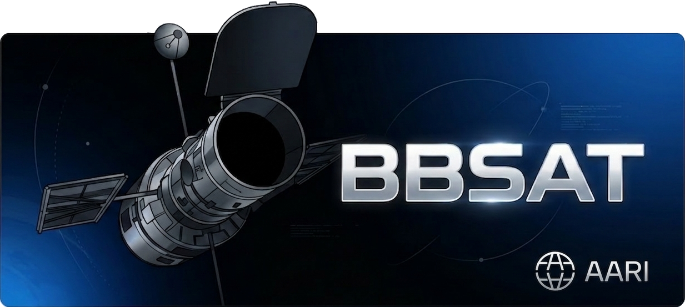
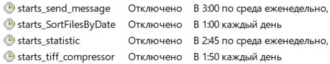

 


---

GDAL :

  

---

- ## **RU**

## :white_check_mark: Проект для обработки приходящей спутниковой информации

### Задача проекта:

- [x] Обработка и сортировка приходящих космических снимков Земли.
- [x] Расчёт статистической информации о количестве обработанных космических снимков Земли и приходящих исходных файлов
      на антенну научно-исследовательского института.
- [x] Рассылка с краткой сводкой по расчётной и статистической информации на e-mail :e-mail: адреса.

### Описание:

- #### :ballot_box_with_check: Проект реализован при помощи следующего программного обеспечения, модулей и библиотек:
  - [x] ~~Интерпретатор языка программирования Python здесь версии 3.11.4.~~
  - [x] Интерпретатор языка программирования Python перенесён в 2026 году на версию 3.14.0.
  - [x] ~~Написан код данного проекта в среде разработки PyCharm 2024.1.4 (Community Edition).~~
  - [x] На момент 2026 года проект перенесён в среду разработки Visual Studio Code (user setup).
  - [x] Реализован проект на операционной системе Windows 10 Pro.

- :large_blue_circle: Пакет GDAL используется в данном проекте как вызываемое из системы приложение (Важно! Чтобы
  вызывать GDAL из системы, он должен быть в системной переменной Path). Само приложение вы можете скачать по данной
  ссылке:
  [Ссылка для скачивания GDAL](https://www.gisinternals.com/release.php) - вам понадобится данная версия:
  **release-1930-x64-gdal-3-9-1-mapserver-8-2-0**

- :red_circle: Зависимости проекта указаны в файле [`requirements.txt`](requirements.txt)

- :lock: **Настройка безопасности для отправки e-mail:**
  Для хранения пароля от почты создайте файл `.env` в корне проекта с содержимым:
  ```
  BBSAT_EMAIL_PASSWORD=ваш_пароль
  ```
  Файл `.env` автоматически исключён из Git (`.gitignore`) и не попадёт в репозиторий.

### Дополнительно:

- #### :information_source: Софт данного проекта запускается локально, на персональном компьютере, с помощью приложения планировщика задач (taskschd.msc) на ОС Windows 10 Pro, несколькими способами:
  - [x] Первый способ — настроить в планировщике задач ежедневный запуск файла `run_bbsat.bat` [*смотрите
        таблицу 1, пример
        1*] (При использовании данного способа рекомендуется в настройке действия указать файл `run_bbsat.bat` как
        аргумент, а
        программу запуска `C:\Windows\System32\cmd.exe`. Также не забывайте про права пользователя при настройке
        работы задачи).
  - [x] Второй способ — указать планировщику задач напрямую запускать файл `main.py` [*смотрите таблицу 1,
        пример
        2*] (Но
        будьте внимательны: для реализации этого способа main.py должен подаваться как аргумент, а интерпретатор как
        программа запуска).
  - [x] Третий способ — аналогично второму способу, но настроить запуск не одного, а четырёх
        скриптов: `sort_files_by_date.py`, `tiff_compressor.py`, `statistic.py`, `send_message.py` через
        планировщик задач.
        Расписание можно настроить вручную в том же планировщике задач [*смотрите таблицу 1, пример 3*].

- :ballot_box_with_check: В проекте также организован вывод хода работы и информации об ошибке или успехе в специальные
  файлы логирования, которые называются: `task_log.txt`, `bat_startup_log.txt`. Учтите, что если не будете
  использовать для запуска файлы `main.py` и `run_bbsat.bat`, то и логирования не будет.

- :repeat: **Защита от множественных запусков:**
  При запуске `main.py` автоматически проверяется, не запущен ли уже планировщик.
  Если обнаружен работающий экземпляр, новый не создаётся.
  Это позволяет безопасно настроить ежедневный запуск через Планировщик задач Windows —
  даже если окно не закрывалось неделю, создастся только один экземпляр.

---

- ## **EN**

## :white_check_mark: Project for processing incoming satellite information

### Project task:

- [x] Processing and sorting incoming space images of the Earth.
- [x] Calculating statistical information on the number of processed space images of the Earth and incoming source files
      to the antenna of the research institute.
- [x] Sending a brief summary of the calculated and statistical information to e-mail :e-mail: addresses.

### Description:

- #### :ballot_box_with_check: The project is implemented using the following software, modules and libraries:
  - [x] ~~The Python programming language interpreter is version 3.11.4.~~
  - [x] The Python programming language interpreter was migrated to version 3.14.0 in 2026.
  - [x] ~~The code for this project was written in the PyCharm 2024.1.4 (Community Edition) development environment.~~
  - [x] As of 2026, the project has been migrated to the Visual Studio Code development environment (user setup).
  - [x] The project is implemented on the Windows 10 Pro operating system.

- :large_blue_circle: The GDAL package is used in this project as a system-callable application (Important! In order to
  call GDAL from the system, it must be in the system Path variable). You can download the application itself from this
  link:
  [GDAL download link](https://www.gisinternals.com/release.php) - you will need this version:
  **release-1930-x64-gdal-3-9-1-mapserver-8-2-0**

- :red_circle: Project dependencies are listed in the [`requirements.txt`](requirements.txt) file

- :lock: **Security setup for e-mail sending:**
  To store the email password, create a `.env` file in the project root with the following content:
  ```
  BBSAT_EMAIL_PASSWORD=your_password
  ```
  The `.env` file is automatically excluded from Git (`.gitignore`) and will not be committed to the repository.

### Additional:

- #### :information_source: The software of this project is launched locally, on a personal computer, using the task scheduler application (taskschd.msc) on Windows 10 Pro OS, in several ways:
  - [x] The first way is to configure the task scheduler to launch the file `run_bbsat.bat` daily [*see table 1,
        example
        1*] (
        When using this method, it is recommended to specify the `run_bbsat.bat` file as an argument in the action
        setup, and the
        launcher `C:\Windows\System32\cmd.exe`. Also, do not forget about user rights when setting up the task).
  - [x] The second way is to tell the task scheduler to directly launch the file `main.py` [*see table 1, example
        2*] (But
        be careful: to implement this method, main.py must be supplied as an argument, and the interpreter as the
        launcher).
  - [x] The third method is similar to the second method, but now configure the launch of not one, but four
        scripts: `sort_files_by_date.py`, `tiff_compressor.py`, `statistic.py`, `send_message.py` via the
        task scheduler. The schedule can be configured manually in the same task scheduler [*see table 1, example 3*].

- :ballot_box_with_check: The project also organizes the output of the work progress and information about errors or
  success in special logging
  files called: `task_log.txt`, `bat_startup_log.txt`. Note that if you do not use the `main.py`
  and `run_bbsat.bat` files for launching, there will be no logging.

- :repeat: **Multiple launch protection:**
  When `main.py` starts, it automatically checks if the scheduler is already running.
  If a running instance is detected, a new one is not created.
  This allows you to safely schedule daily launches via Windows Task Scheduler —
  even if the window has not been closed for a week, only one instance will be created.

---

## :clipboard: Таблица 1 Пример планировщик задач : Table 1 Example task scheduler

|    №    |   Изображения примеров : Example images    |
| :-----: | :----------------------------------------: |
| **(1)** |  |
| **(2)** |  |
| **(3)** |  |

> **!** Пример расписания, настроенного в ОС Windows 10 Pro в приложении (taskschd.msc)
>
> **!** An example of a schedule configured in Windows 10 Pro OS in the (taskschd.msc) application

## :scroll: Таблица 2 Импортируемые пакеты : Table 2 Imported packages

| Язык : Language | Пакет : Package | Версия : Version |
| :-------------: | :-------------: | :--------------: |
|     Python      |       pip       |      26.0.1      |
|     Python      |    schedule     |      1.2.2       |

> **!** У данного проекта настроено на локальной машине виртуальное окружение (.venv), что рекомендуется сделать и
> пользователю для того, чтобы не возникало конфликтов между установленными пакетами.
>
> **!** This project has a virtual environment (.venv) configured on the local machine, which is recommended for the
> user to do so, so that conflicts do not arise between installed packages.

---

| Центр Ледовой и Гидрометеорологической Информации (ЦЛГМИ) Центр "Север" | Center of Ice and Hydrometeorological Information (CIHMI) Center "Sever" |
| :---------------------------------------------------------------------: | :----------------------------------------------------------------------: |
|     Арктический и антарктический научно-исследовательский институт      |                 Arctic and Antarctic Research Institute                  |
|                      ФГБУ "ААНИИ", Санкт-Петербург                      |                       FSBI "AARI", St. Petersburg                        |
|                          Почта: sever@aari.ru                           |                          E-mail: sever@aari.ru                           |
|                         Почта: vvbusev@aari.ru                          |                         E-mail: vvbusev@aari.ru                          |
|                                           |                                        |

---

<p align="center">
  
</p>
